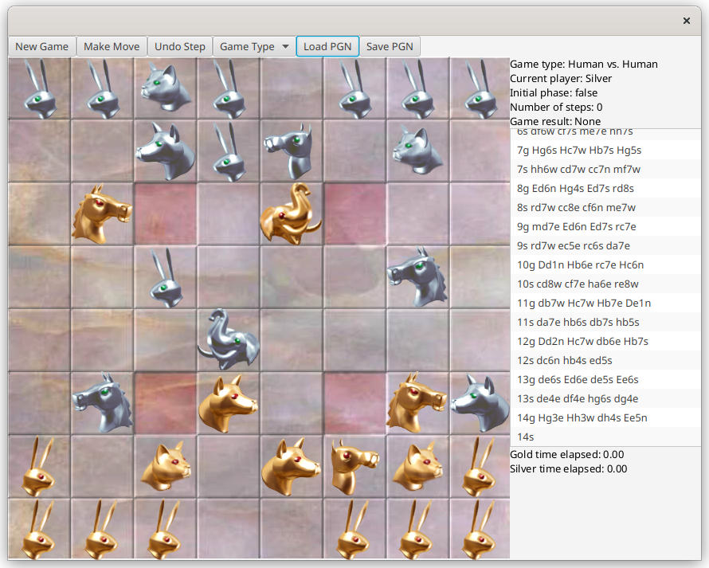

# Arimaa Java Client

Application for playing [Arimaa](http://arimaa.com).
Made as a semester project for Java course.



## How to install & run

For compiling & running the application Java 17+ is required.

### Linux

```bash
./mvnw javafx:run
```

### Windows

```bash
mvnw.cmd javafx:run
```

## How to play

To start a new game, click "New Game" button.

To arrange pieces in the initial phase, click one on a piece and then click on
another piece, which results in swapping.
Move pieces by clicking on the square you want to the piece from, then
click on the destination square. If the desired step is valid, it is made and
the view is updated accordingly. To do undo the previous step, click "Undo Step"
button. To finish making your steps, click "Make Move" button for other player
to start making their steps.

To change game type, click on "Game Type" button and click on the desired game
type button.

To load a game from the given PGN file, click "Load PGN" button and select a file
to be loaded from. To save your current game, click on "Save PGN" button and select
a file to be saved into.

## Application architecture

Originally the underlying architecture for the application was
MVC (model-view-controller), but due to inexperience and bad code I am unable
to conclude whether it truly is. For reviewing the logic part look at classes
Game and Board. For the view part look at GameView class. And for the controller
part take a look at GameController class.

## Software stack

- Java 17
- JavaFX (for creating graphical user interface)
- JUnit 5 (for creating unit tests)
